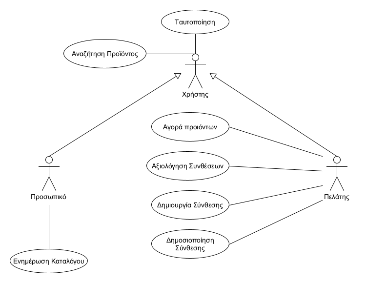

# Εφαρμογή σύνθεσης H/Y

Ένα απλό πρότυπο οργάνωσης του κώδικα και της τεχνικής τεκμηρίωσης για τις εξαμηνιαίες εργασίες του μαθήματος Τεχνολογία Λογισμικού ([INF138](https://eclass.aueb.gr/courses/INF138/)) του Τμήματος Πληροφορικής Οικονομικού Πανεπιστημίου Αθηνών.

Η τρέχουσα έκδοση περιλαμβάνει την [προδιαγραφή των απαιτήσεων λογισμικού](docs/markdown/software-requirements.md) με προσαρμογή του `IEEE Std 830-1998` για την ενσωμάτωση απαιτήσεων σε μορφή περιπτώσεων χρήσης. Για περισσότερες λεπτομέρειες μπορείτε να ανατρέξετε στο βιβλίο [Μ Γιακουμάκης, Ν. Διαμαντίδης, Τεχνολογία Λογισμικού, Σταμούλης, 2021](https://www.softeng.gr).

## [***Απαιτήσεις Λογισμικού***](docs/markdown/software-requirements.md) σε μορφή κειμένου

Οι δύο άμμεσα ενδιαφερόμενοι(stakeholders) του συστήματός μας, οι άμμεσοι χρήστες, 
είναι οι πελάτες και το προσωπικό της επιχείρισης.

Το προσωπικό της επιχείρισης θα έχει τη δυνατότητα να τροποποιεί τον κατάλογο των εξαρτημάτων, προσθέτοντας, αφαιρώντας και μεταβάλλοντας τα χαρακτηριστικά των προϊόντων(τιμή, όνομα κτλπ) καθώς και των προσφερόμενων απαιτούμενων θυρών για την λειτουργία τους.(ικανοποίηση της απαίτησης συμβατότητας)

Οι πελάτες θα έχουν τη δυνατότητα να αναζητούν μεμονωμένα προϊόντα και συνθέσεις καθώς και να μαθαίνουν σχετικές πληροφορίες για αυτά. Ακόμη, θα μπορούν να δημιουργούν τις δικές τους συνθέσεις Η/Υ, να τις αποθηκεύουν για μελοντική αγορά, να τις δημοσιοποιούν και να αξιολογούν τις συνθέσεις άλλων. Τέλος, οι πελάτες μπορούν να προσθέτουν μεμονωμένα εξαρτήματα και συνθέσεις στο καλάθι αγορών τους και να ολοκληρώνουν την αγορά, συμπληρώνοντας τα στοιχεία χρέωσης στην σχετική φόρμα. 

Για να μπορέσει να υλοποιηθεί η διαδικασία αποθήκευσης συνθέσεων, το σύστημα θα πρέπει να αποθηκεύει καθώς και να ανακτά τις πληροφορίες αποθήκευσης για κάθε προσωποποιημένο χρήστη. Για την υλοποίηση της δημοσιοποίησης και αξιολόγισης των συνθέσεων, το σύστημα θα πρέπει να αποθηκεύει και να ενημερώνει κατάλληλα τον κατάλογο των εξαρτημάτων. Επίσης, για την πραγματοποίηση της αγοράς, το σύστημα θα πρέπει να ελέγχει αν η σύνθεση πληροί τις προϋποθέσεις συμβατότητας και πληρότητας. Σε άλλη περίπτωση θα παροτρείνει τον χρήστη να τροποποιήσει την σύνθεσή του.

Τέλος, θα διασφαλίζεται η ταυτοποίηση των χρηστών και του προσωπικού με την είσοδό τους στο σύστημα.

[***Παραδοχές που έγιναν σχετικά με τις παραπάνω απαιτήσεις***](docs/markdown/software-requirements.md/#υποθέσεις-και-εξαρτήσεις)

## 

