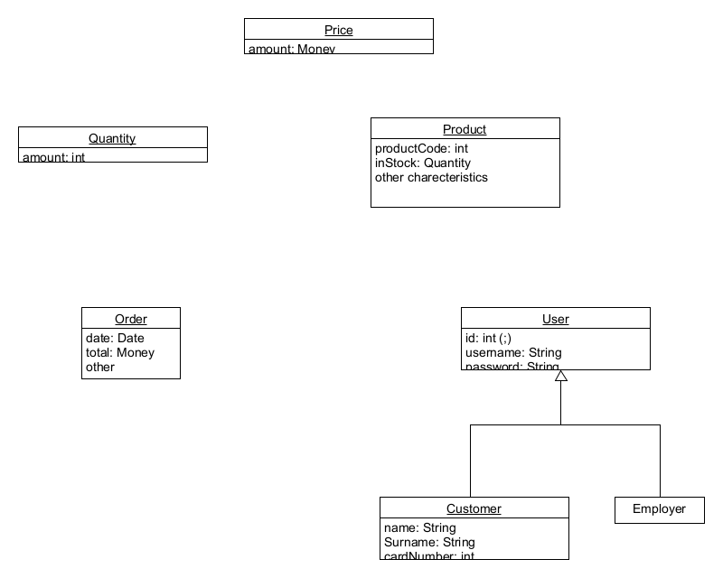
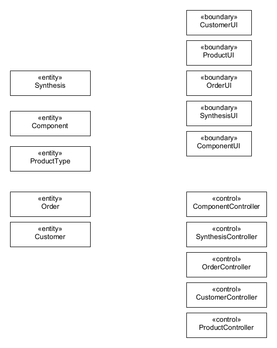
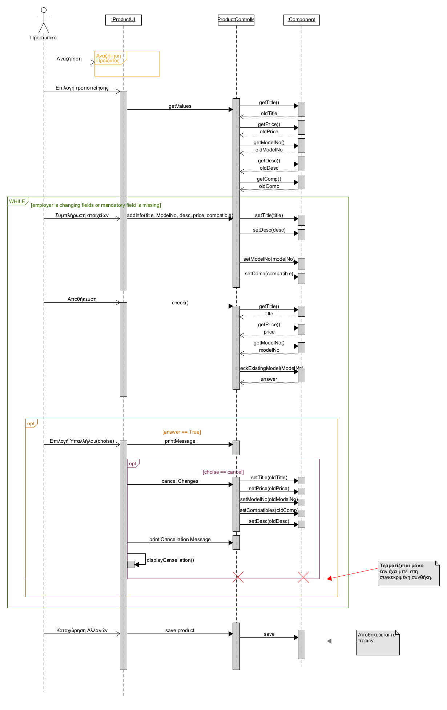
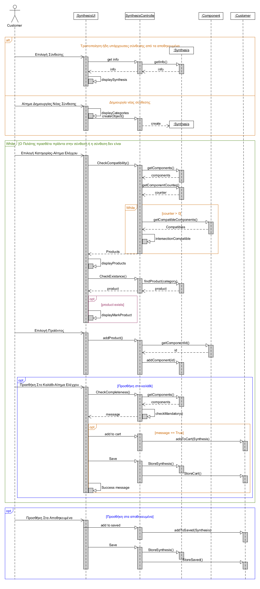
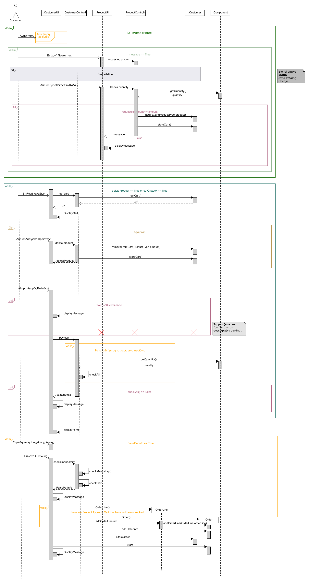

# Introduction

<mark style= 'color:white; background-color:orange; '>TeckTrove</mark>

Our app is meant to serve the tech community by offering a tool to simplify the process
PC synthesis and purchase. Our team's goal is to provide a fun experience in the world of technology
by ensuring the excellent cooperation of the material. Our team's priority is to facilitate navigation in the jungle
of electronic systems.

# General description

## Use Case Model Overview

| Use Cases | Title | Description |
| :---- | :------------------------------ | :---------------------------------|
| UC1 | [User Authentication](uc1-user-authentication.md) | The System identifies and authenticates Users (Customers and Employees) |
| UC2 | [Product Search](uc2-product-search.md) | The User sees the information of the products that interest them|
| UC3 | [Update Catalogue](uc3-update-catalogue.md) | Company staff will be able to add, delete and modify product compatibility information |
| UC4 |[Synthesis Rating](uc4-pc-rating.md) | Users will be able to rate other users' published compositions and view existing ratings |
| UC5 | [Composite Publishing](uc5-publishing.md) | The customer will be able to publish their synthesis so that they are visible and accessible to other users (individual purchase)|
| UC6 | [Synthesis Creation](uc6-pc-creation.md) | The customer will be able to save his completed composition |
| UC7 | [Product Purchase](uc7-product-purchase.md) | The Customer selects the pc synthesis/individual components he wants to buy |

## Assumptions and dependencies

#### For the implementation of our software we make the following assumptions:

- We consider that the information provided by the user when completing the purchase is correct. (If, for example, the user enters a 16-digit card number)
- We consider that the user has sufficient balance on his card.
- We assume that there will already be an initial catalog of products.
- A customer to publish a composition they created must first purchase it.
- A customer to review a published composition must first purchase it.
- A composition created by a customer can be saved, even if it is incomplete.
- A composition is checked for completeness once it is added to the shopping cart.
- When creating a composition, compatibility checking (filtering) is done after adding each individual component. Thus, only the products that are compatible with the previously selected ones are displayed as a choice for the next category.
- Each user of the application will be accompanied by a UserID. For the customer, an id will be issued through a number generator, while for the employee, the employee himself will take care to enter his id, which will have been given to him by the employer.
- Each Customer will ONLY be able to rate each composition once.
- Each Product when added for the first time, will have a positive quantity.
- Each Composition can contain a maximum of 1 product from each category.
- We believe the billing information is correct.
- We consider each component to have unique necessary ports.

#### For the implementation of our software we have the following dependencies:

- Adding and removing products from the cart are related actions. (customer)
- Adding and removing products from the catalog are related actions. (employee)
- To enter/identify a user in the system (log in), the user must first be registered (sign up). (user)
- To complete the purchase, the user must have a valid cart and fill in billing information.
- Each Customer will ONLY be able to evaluate compositions that he has purchased.

# Special requirements

## Use Cases

### Stakeholders and their needs

| Stakeholder | Need |
| :---- | :------------------------------ |
| Customer | <ul><li>To buy products</li><li>To search for products and learn information about them</li> <li>To save compositions that interest him and create</li><li>To evaluate the published compositions</li><li>To publish the compositions he created</li></ul> |
| Employee | <ul><li>Add products</li><li>Delete products</li><li>Update product information</li></ul> |

### Actors of the system

| Actor | Description | Target | Stakeholders |
| :---- | :------------------------------ | :-------------- | :--------------------|
| User | Any person enrolled in the System | Product Search| User|
| Customer | Any User logged into the system as a "Customer" | Buy products | Customer|
| Employee | Any User logged into the system as an "Employee"| Catalog Update | Employee|

### Use case descriptions

[UC1 User Authentication](uc1-user-authentication.md)

[UC2 Product Search](uc2-product-search.md)

[UC3 Update Catalog](uc3-update-catalogue.md)

[UC4 Synthesis Rating](uc4-pc-rating.md)

[UC5 Synthesis Publishment](uc5-publishment.md)

[UC6 Synthesis Creation](uc6-pc-creation.md)

[UC7 Product Purchase](uc7-product-purchase.md) 

## Non-functional Requirements

### Interface requirements

#### User interfaces

- The System will operate in English.

#### Communication interfaces

- The updating of the data of the product catalogs by the employees will be done using Wifi.

#### Software interfaces

- The User will be able to interact with the application via GUI (touch screen).

### Design and implementation limitations

- Our system will be a local Android application installed in a mobile device environment, internet connection is not indicated.
- To use the application, it is required to be installed on a PC and/or smartphone.
- Our application will be developed in java language.
- The minimum version of Java that can be used to run the application is Java 8.
- The GUI will only be provided in English

### Quality characteristics

#### Performance
 
- The response of the System to each stimulus will be done in an immediate period of time (10") from receiving the stimulus until the reaction of the system is carried out. (e.g. catalog update)

(Speed-Responsiveness-Interpersonal Ability)

#### Availability

- The System will be available at any time.(24/7)
- The time of unavailability of services will not exceed 60 seconds.

(Permanence-Responsiveness-Reliability)

#### Security

- The System supports the secure access of users to the service. (1st level of security)
- The functions of our e-shop will be available only to registered users, with an authentication process. (2nd level of security)
- System will hide functions between different authorized roles.(3rd security level)
- The System will hide personal data between different registered users. (4th security level)
- The System will allow the appropriate modification of the data only by authorized Users. (5th security level)

(Accessibility-Confidentiality-Uniqueness)

#### Flexibility

- The application will be able to cope with a short reaction time to various changes/additions to its software. It will be able to be flexible in maintenance (upgrades, etc.) in a relatively short period of time. (adjustment of management technology)
- The application will be able to be launched at any time from mobiles that support the Android operating system.

(Maintenance-Adaptability)

#### Ease of use

- The only requirement for the User is to know basic app browsing knowledge.
- The System easily and comprehensibly guides the User through all the steps to search for information on a product and to purchase/update the catalog to the Customer/Employee, with corresponding messages and clear/understandable options.
- In situations where the User unintentionally makes a mistake, the System returns to the previous step the User was in (not the whole process from the beginning) and with appropriate messages and providing options (eg a button for whether the data entered are correct or another error has occurred), provides it with a very understandable and intuitively functional environment.

(Forgiveness of mistakes-Unexpected functionality-Convenience)

# Supporting material

## Domain model

## Use case analysis
--------------------------

### Analysis classes

### Behaviors

#### Product Modification

#### Create Composition

#### Purchase

## Business Rules

| Business Rules | Description |
| :----------------------| :---------|
| BR1 | The serial number and name of each product are unique
| BR2 | All customer details are mandatory, with the exception of billing details (required in case of purchase)
| BR3 |Each user's username is unique
