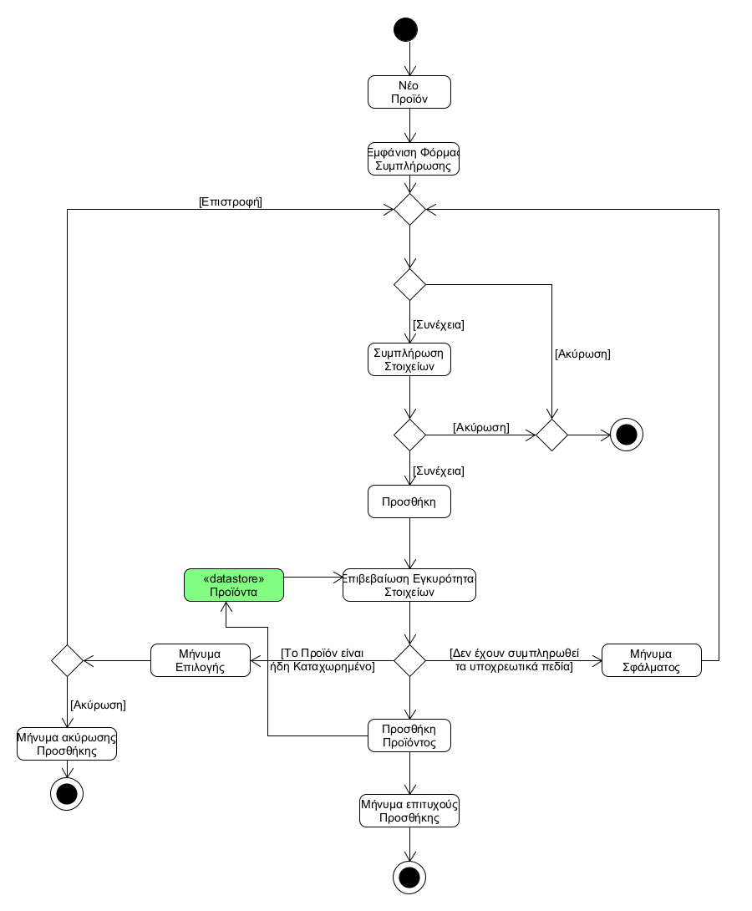

# UC3. Catalog Update

**Primary Actor**: Employee

**Interested:**
- **Employee**: Wants to provide a product catalog, where all products and their information will be visible to customers.
- **Customer**: Wants to be able to see the information of the products provided.

**Conditions**: The Employee has successfully executed the "User Authentication" use case.

## Basic Flow

### A) Product addition

1. The Employee chooses to add a product to the catalog.
2. The System displays the product details form.
3. The Employee fills in the form (product name, product code, etc.).
4. The Employee confirms the information and clicks add.
5. The System confirms the validity of the data (filling in mandatory data, already registered product).
6. The System adds the product to the catalog.
7. The System displays a successful addition message.

 

**Alternative Flows**

*2a-4a. The Employee decides not to add the product.*
1. The Employee chooses cancellation.
2. UC terminates.
---

*5a. The Employee has not filled in the mandatory fields.*
1. The System displays a relevant message, with the unfilled fields highlighted.
2. The UC returns to step 3.
---

*5b. The Product is already registered.*
1. The System displays a message to the Employee about whether it is a wrong product name/code entry or not.
2. The Employee chooses appropriately.
     * 2a. The employee chose the wrong field.
         1. The System returns to step 3 of the basic flow.
     * 2b. The Employee chose to cancel.
         1. UC terminates.
---

*At any point the software crashes.
1. The User restarts the application
2. The process returns to step 2 of UC1.
---

### B) Removal of Product

1. [Employee searches for the product](uc2-product-search.md) he wants to remove from the catalog.
2. The Employee confirms the information and selects deletion.
3. The System removes the product from the catalog.

 

**Alternative Flows**

*1a. Product does not exist*
1. The System displays a relevant message.
2. UC terminates.
---

*1b / 2a. The Employee decides not to delete the product.*
1. The Employee chooses cancellation.
2. UC terminates.
---

*At any point the software crashes.
1. The User restarts the application
2. The Process returns to step 2 of UC1.
---

### C) Modification of Product Details

1. [Employee searches for the product](uc2-product-search.md) he wants to modify.
2. The Employee selects a field to modify.
3. The Employee types the new item.
4. Steps 2 and 3 are repeated until the employee is satisfied.
5. The Employee selects save.
6. The System saves the new details for the product.

 

**Alternative Flow**

*1a-4a. The Employee decides not to modify the data.*
1. The Employee chooses cancellation.
2. UC terminates.
---

*6a. The Product is already registered.*
1. The System displays a message to the Employee about whether it is a wrong product name/code entry or not.
2. The Employee chooses appropriately.
     * 2a. The employee chose the wrong field.
         1. The System returns to step 3 of the basic flow.
     * 2b. The Employee chose to cancel.
         1. The System displays a message to cancel the changes.
         2. UC terminates.
---
*6b. The Employee deleted required fields.*
1. The System displays a relevant message.
2. The Process returns to step 2 of the basic flow.
---

*At any point the software crashes.
1. The User restarts the application
2. The Process returns to step 2 of UC1.

## Activity Diagram

## Sequence Diagram
