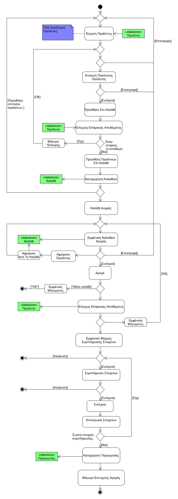

# UC7. Products Purchase

**Primary Actor**: Customer

**Stakeholders:**
- **Customer**: He wants to buy the products he has added to the cart (compositions, parts).

**Preconditions**: Customer has successfully completed the "User Authentication" use case and in some cases "Create Composition".

## Basic Flow

### A) Products Purchase

1. [Customer searches for a product](uc2-product-search.md) that they want to add to their cart (Individual components or published compositions).
2. The Customer selects a product quantity.
3. The Customer presses "Add to cart".
4. The System checks if the quantity of each component is covered by the available stock (Individually or in combinations).
5. The System adds the product to the cart.
6. Steps 1-5 are repeated as long as the customer searches for products.
7. The Customer selects the shopping cart.
8. The System displays the basket of products.
9. The Customer selects "Buy".
10. The System checks if the products in the cart are still available in the quantity requested by the customer.
11. The System shows the customer the form for filling in his card details as well as the total amount of the basket that he is required to pay.
12. The Customer fills in his details in the payment form (billing details).
13. The Customer confirms his details and selects "Continue".
14. The System validates the customer's card details (16-digit card number).
15. The System registers the order.
16. The System displays a successful purchase message.
 

**Alternative Flows**

*1a. The Customer does not wish to purchase another product.*
1. The Process returns to step 7 of the basic flow.
---

*2nd / 3rd / 9th. The Customer wishes to return to the product search.*
1. The Customer selects "Return".
2. The Process returns to step 1 of the basic flow.
---

*12a / 13a. The customer's desire to purchase ceases to exist.*
1. The Customer selects "Cancel".
2. UC terminates.
---

*5a. The quantity of one or more parts that the customer requires cannot be met from the available stock.*
1. The System displays a message of lack of the specific availability.
2. The Customer selects "OK".
3. The UC returns to step 2 of the basic flow.
---

*9b. The Customer wishes to remove products from the cart.*
1. The Customer selects "Remove" the product.
2. The System removes it from the cart.
3. The PC returns to step 8 of the basic flow.
---

*10a. The customer's cart is empty.*
1. System displays appropriate message.
2. The Customer selects "OK".
3. UC terminates.
---

*11a. The product(s) are no longer available in the requested quantity.*
1. System displays appropriate message.
2. The Customer selects "OK".
3. The Process returns to step 8 of the basic flow.
---

*14a. One of the required details has not been entered or the details are incorrect.*
1. System displays appropriate error message.
2. The Customer selects "OK".
3. The PC returns to step 12 of the basic flow.
---

*At any point the software crashes.
1. Customer restarts the application.
2. The Process returns to step 2 of UC1.

## Activity Diagram
